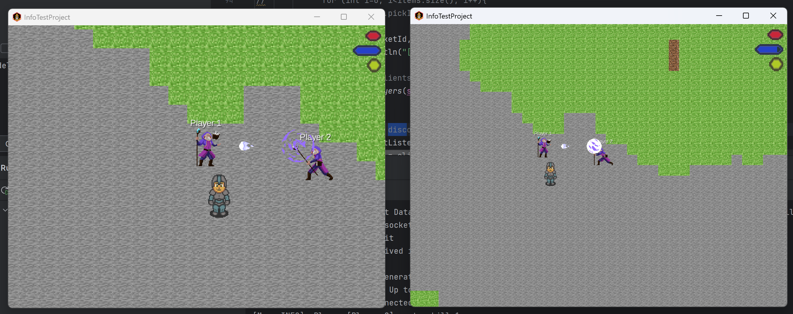

# Become A Endless Fighter

A student project made by the members of Info class of Privates Gymnasium Schloss Torgelow
## Project Demo

## Install the Game
you can download it on the release page(comming soon)
[Install the Game](https://github.com/TheCyberWeaver/InfoTestProject/wiki/Install-the-Game)

## Setting Up for Contributors (Windows & IOS)
Check our wiki page
[Setting up Development Environment](https://github.com/TheCyberWeaver/InfoTestProject/wiki/Setting-Up-Development-Environment)

## Gradle
This project uses [Gradle](https://gradle.org/) to manage dependencies.
The Gradle wrapper was included, so you can run Gradle tasks using `gradlew.bat` or `./gradlew` commands.
Useful Gradle tasks and flags:

- `build`: builds sources and archives of every project.
- `lwjgl3:jar`: builds application's runnable jar, which can be found at `lwjgl3/build/libs`.
- `lwjgl3:run`: starts the application. (<- Use this one)
